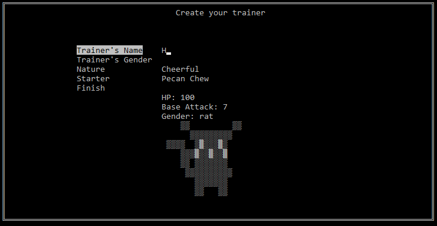
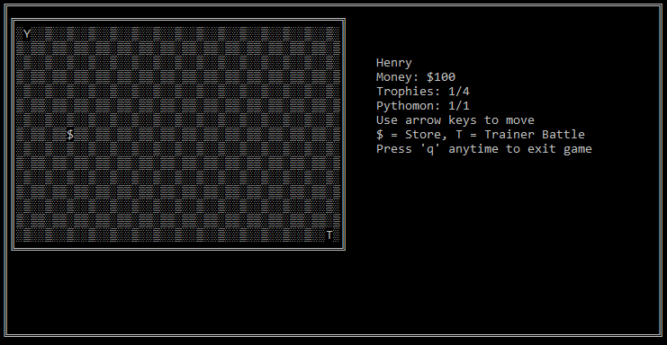
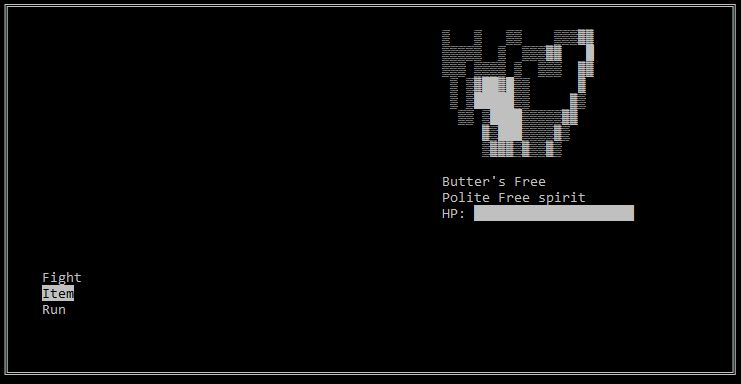

# 🐍 Pythomon 🐍
### *A Capture and Battle game you can play in your python terminal!*

*Video Demo*
## Description
Pythomon is a text based, terminal game, where you could probably where it takes inspiration. I developed it for an Python homework assignment during my spring 2022 semester, when I was getting my undergraduate at Hunter College. You can read the spec requirements in [`pokemon_spec.txt`](/pokemon_spec.txt).

The game revolves around encountering, battling, and collecting random monsters in field, surviving and getting stronger with each encounter. In order to do this, the player will move a cursor representing themselves on a grid. 

Once you you've build up your team, you take on another trainer and compete for their prized pythmon. Once you defeat three trainers, and claim the three prizes, you win the game!

The game utilizes the `curses` library, creating a more animated and seamless user experince, rather than have to go through a series of endless text prompts and prints. 

## Requirements
- Python (tested with ver. 3.9+).
- The `curses` module. For Windows systems, install [`windows-curses`](https://pypi.org/project/windows-curses/) with `pip`.
- Terminal window size of at least 25 height and 92 width.

## How to run
Simply clone this repository, then navigate into the root directory in your terminal. Then run `python main.py` and the game will run (provided you have `curses` installed).

To quit, press `q` anytime after creating a character and hit `y` to confirm.

## Additional/Bonus Features from tech spec
- `curses` Implimentation
- Capturing mechanic
- Hidden items on the grid
- Item Store class/mechanic
- Revive mechanic
- EXP/Level up system
- Kind of weird ASCII Art

## Implimentations
- ### Player class
    - Properties
        - Name
        - Gender
        - Money
        - Nature
        - Pythomon collection
        - Item Bag
        - Trophy collection
    - Methods
        - Check if player is defeated (when all of player's pythomon are dead)
        - Buying items
- ### Pythomon class
    - Properties
        - Name
        - Max HP
        - Current HP
        - Base ATK
        - Gender
        - Nature
        - Move set
        - Exp Amount
        - Defeat prizes for the player (exp and money)
        - Status (alive or dead)
        - Healthbar
    - Methods
        - Level up
        - Attack
        - Heal
        - Revive
- ### Trainer class
    - Properties
        - Name
        - Pythomon collection
        - Prize Money
        - Their Prized Pythomon
        - A blurb about them
- ### Square/Tile class
    - Properties
        - Terrain type. Can be grass, encounter, store, or trainer
        - Player occupation - signifies if user is on the tile
    - Used to create a grid (a 2D square/tile array)

- ### Store (bonus)
    - Properties
        - Contains a dict with 4 items and their prices

## Gameplay

- ### Player Creation
    Player creates their trainer, where they also select one of the four prized pythomon

- ### Grid Movement
    After creation, the play can move around the grid with the arrow keys. There are 5 different terrains the player can land on. The player is represented with a `Y`.
    1. Grass - Does nothing, player can freely move to adjacent tile
    2. Store - Represented with a `$` - Player can freely enter and leave the store, to purchase items
    3. Trainer - Represented with a `T` - Once the player enters this tile, the battle with the trainer will begin (and the player cannot leave!).
    4. Encounter - Hidden - When a player stumbles onto this tile, battle with a random wild pythomon start (though the player can freely leave). After the encounter, the encounter tiles respawn their locations.
    5. Item - Hidden - Player stumbles upon a nice surprise and is gifted with a random item or money! There are 5 for every level.

- ### Battle
    This is where the bulk of the gameplay takes place. The player is confronted with an opposing pythomon. The player will be faced with several initial choices:
    1. Choose which of their pythomon to deploy and engage in battle
    2. Use some items before hand, such as heal, or revive
    3. If it is a wild encounter, they could run and leave the battle entirely

    After choosing a pythomon to deploy, the fight begins! The player can then:
    1. Attack - choose a moveset their pythomon has and attack the opposing pythomon!
    2. Item - Use an item, though they can only use one item once they're in a battle.
    3. Switch - Swap out another pythomon in their team
    4. Run - If it's a wild encounter, disengage from the battle

    After attacking and dealing damage, it's the opposing pythomon's turn to attack. This will continue back and forth until one of the pythomon dies.

- ### If the player wins a battle:
    - Money is awarded to the player, with the winning pythomon gains exp. Once they gain 100 exp, they'll level up and become even stronger!
    - Exp is also awarded to the entire team, at half the exp.

- ### If the player loses the batle
    - The player's pythomon is considered 'dead', though can be revived with a Revive item
    - If the player has other pythomon that are alive, the player can deploy them
    - Otherwise, the player is considered defeated and the game is over

- ### Capturing Mechanic (Bonus)
    - Aside from defeating your opponent, you can also capture them and have them part of your team!
    - When the opposing pythomon's health is low enough, you can use a 'Capture Ball' and have them join your team!

## Files
- `main.py` - Contains the environment check and initializaiton of the game and variables, and main loop through grid movement and sequence
- `screens.py` - Contains key screen functions that visually setup each seperate part of the game, as well as relevant keyboard listeners and handlers
- `battle.py` - The entire battle function/sequence and handlers.
- `prompts.py` - Individual visual elements and prompts used to help create the visual aspects for screens
- `classes.py` - Custom python objects created for this game
- `assests.py` - Contains ASCII art as well as pythodeck, with various pythomon information.
